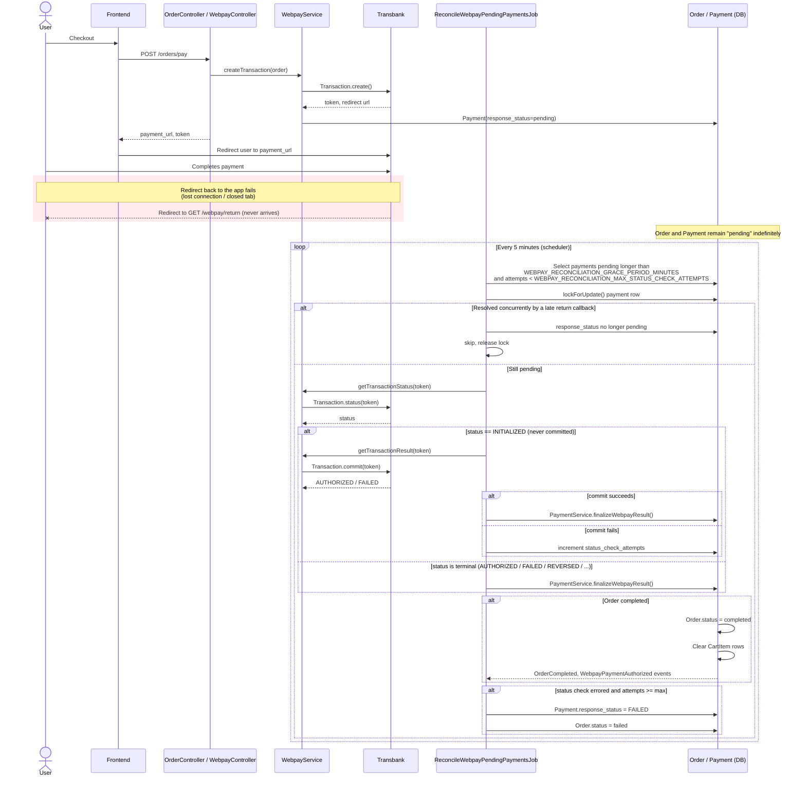

# Webpay payment reconciliation

## Problem

The normal Webpay Plus flow relies on Transbank redirecting the shopper's
browser back to `GET /webpay/return` after payment. If that redirect never
arrives — the user loses their connection, closes the tab, or Transbank's
site fails to redirect — the `Order` and `Payment` rows are left in
`pending` forever, even though Transbank may have actually authorized (and
captured) the transaction on their end.

`ReconcileWebpayPendingPaymentsJob` (`app/Jobs/ReconcileWebpayPendingPaymentsJob.php`)
closes that gap: on a schedule, it polls Transbank's `Transaction::status`
endpoint for any Webpay payment that's been `pending` longer than a
configurable grace period, and finalizes it exactly like the return
callback would — via the same `PaymentService::finalizeWebpayResult` used
by `WebpayController::return`.

## Configuration

Set in `.env` (see `config/webpay.php`):

| Variable | Default | Meaning |
| --- | --- | --- |
| `WEBPAY_RECONCILIATION_GRACE_PERIOD_MINUTES` | `5` | Minimum age a pending payment must reach before the job checks it. Avoids racing the normal return-callback flow, which usually completes within seconds. |
| `WEBPAY_RECONCILIATION_MAX_STATUS_CHECK_ATTEMPTS` | `5` | How many times the job will query a stuck payment's status before giving up and marking the order as `failed`. |

The job itself is scheduled every 5 minutes (`routes/console.php`).

## Sequence diagram

## Notes / trade-offs

- **Idempotency**: the job locks the `Payment` row (`lockForUpdate`) and
  re-checks `response_status` before acting, so it can't race a return
  callback that lands at the same time and double-fire
  `OrderCompleted` / `WebpayPaymentAuthorized` or double-create the Random
  ERP document.
- **Commit vs. status**: `status()` alone won't advance an `INITIALIZED`
  transaction — only `commit()` does. The job calls `commit()` (via
  `WebpayService::getTransactionResult`) when status is still
  `INITIALIZED`, which is safe to call even if nobody has committed the
  transaction yet.
- **Giving up**: after `WEBPAY_RECONCILIATION_MAX_STATUS_CHECK_ATTEMPTS`
  failed status checks, the order is marked `failed`. This is logged as an
  error (`Log::error`, "giving up after max status check attempts") because
  if Transbank actually captured the payment despite the checks failing,
  that money is now unaccounted for in the app and needs manual
  reconciliation.
